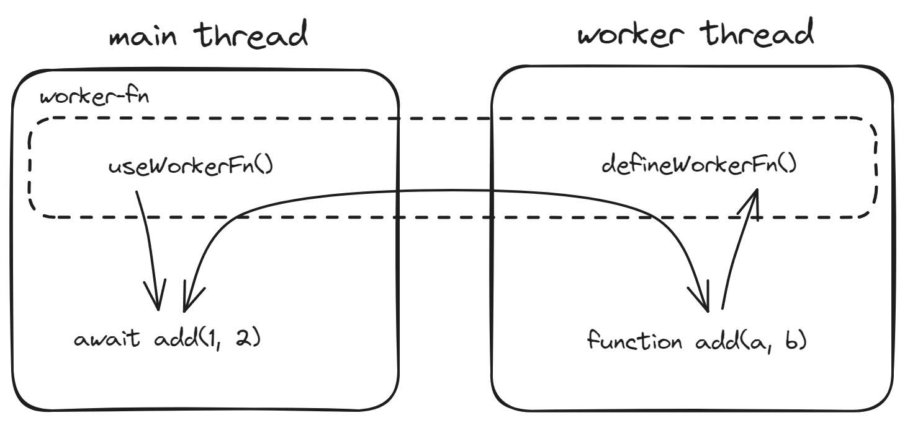

# worker-fn

[](./LICENSE)
[)](https://jsr.io/@mys/worker-fn)
[)](https://www.npmjs.com/package/worker-fn)
[](https://bundlephobia.com/package/worker-fn)
[](https://www.npmjs.com/package/worker-fn)
[](https://github.com/mys1024/worker-fn/actions/workflows/ci.yml)
[](https://github.com/mys1024/worker-fn/actions/workflows/release.yml)

[English](./README.md) | 中文文档

`worker-fn` 隐藏了主线程与 [Worker](https://developer.mozilla.org/docs/Web/API/Web_Workers_API) 线程之间通信的复杂性，简化了调用定义在 Worker 中的函数。

你可以通过 `worker-fn` 在 JavaScript 主线程中创建函数签名与**工作函数**一致的**代理函数**（除了代理函数的返回值会包裹在 Promise 中），代理函数会调用定义在 Worker 线程中对应的工作函数。



## 用法

### 在浏览器或 Deno 中使用

`math.worker.ts`:

```typescript
import { defineWorkerFn } from "worker-fn";

function add(a: number, b: number) {
  return a + b;
}

function fib(n: number): number {
  return n <= 2 ? 1 : fib(n - 1) + fib(n - 2);
}

defineWorkerFn("add", add);
defineWorkerFn("fib", fib);

export type Add = typeof add;
export type Fib = typeof fib;
```

`math.ts`:

```typescript
import { useWorkerFn } from "worker-fn";
import type { Add, Fib } from "./math.worker.ts";

const worker = new Worker(new URL("./math.worker.ts", import.meta.url), {
  type: "module",
});

export const add = useWorkerFn<Add>("add", worker);
export const fib = useWorkerFn<Fib>("fib", worker);

console.log(await add(1, 2)); // 3
console.log(await fib(5)); // 5
```

### 在 Node.js 中与 `node:worker_threads` 一起使用

`math.worker.ts`:

```typescript
import { parentPort } from "node:worker_threads";
import { defineWorkerFn } from "worker-fn";

function add(a: number, b: number) {
  return a + b;
}

function fib(n: number): number {
  return n <= 2 ? 1 : fib(n - 1) + fib(n - 2);
}

defineWorkerFn("add", add, { port: parentPort! });
defineWorkerFn("fib", fib, { port: parentPort! });

export type Add = typeof add;
export type Fib = typeof fib;
```

`math.ts`:

```typescript
import { Worker } from "node:worker_threads";
import { useWorkerFn } from "worker-fn";
import type { Add, Fib } from "./math.worker.ts";

const worker = new Worker(new URL("./math.worker.ts", import.meta.url));

export const add = useWorkerFn<Add>("add", worker);
export const fib = useWorkerFn<Fib>("fib", worker);

console.log(await add(1, 2)); // 3
console.log(await fib(5)); // 5
```

## 从 JSR 导入

`worker-fn` 同时发布在 [npm](https://www.npmjs.com/package/worker-fn) 和 [JSR](https://jsr.io/@mys/worker-fn) 上。

如果你使用 [Deno](https://deno.com), 你可以从 JSR 导入 `worker-fn`:

```typescript
import { defineWorkerFn, useWorkerFn } from "jsr:@mys/worker-fn@2";
```

## License

MIT License &copy; 2024-PRESENT mys1024
