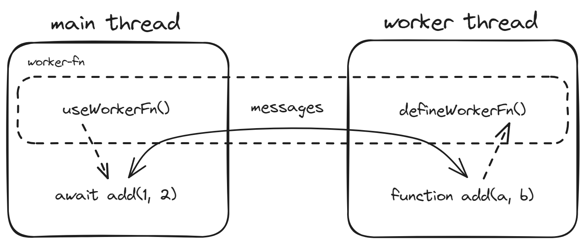

<div align="center">

# worker-fn

[](https://jsr.io/@mys/worker-fn)
[](https://www.npmjs.com/package/worker-fn)
[](https://bundlephobia.com/package/worker-fn)
[](https://jsr.io/@mys/worker-fn/doc?style=flat-square)
[](https://github.com/mys1024/worker-fn)
[](./LICENSE)

[](https://github.com/mys1024/worker-fn/actions/workflows/ci.yml)
[](https://github.com/mys1024/worker-fn/actions/workflows/release.yml)

[English](./README.md) | 中文文档

</div>

`worker-fn` 隐藏了 JavaScript 主线程与
[Worker](https://developer.mozilla.org/docs/Web/API/Web_Workers_API)
线程之间的通信的复杂性，可以让你方便地调用定义在 Worker 中的函数。

你可以通过 `worker-fn` 在 JavaScript
主线程中创建函数签名与**工作函数**一致的**代理函数**（除了代理函数的返回值会被包裹在
Promise 中），代理函数会通过消息事件调用定义在 Worker 中的对应的工作函数。



## 用法

### 基本使用

`math.worker.ts`:

```typescript
import { defineWorkerFn } from "worker-fn";

function add(a: number, b: number) {
  return a + b;
}

function fib(n: number): number {
  return n <= 2 ? 1 : fib(n - 1) + fib(n - 2);
}

defineWorkerFn("add", add);
defineWorkerFn("fib", fib);

export type Add = typeof add;
export type Fib = typeof fib;
```

`math.ts`:

```typescript
import { useWorkerFn } from "worker-fn";
import type { Add, Fib } from "./math.worker.ts";

const worker = new Worker(new URL("./math.worker.ts", import.meta.url), {
  type: "module",
});

const add = useWorkerFn<Add>("add", worker);
const fib = useWorkerFn<Fib>("fib", worker);

console.log(await add(1, 2)); // 3
console.log(await fib(5)); // 5
```

### 在 Node.js 中配合 `node:worker_threads` 使用

<details>

<summary>例子</summary>

`math.worker.ts`:

```typescript
import { parentPort } from "node:worker_threads";
import { defineWorkerFn } from "worker-fn";

function add(a: number, b: number) {
  return a + b;
}

function fib(n: number): number {
  return n <= 2 ? 1 : fib(n - 1) + fib(n - 2);
}

defineWorkerFn("add", add, { port: parentPort! });
defineWorkerFn("fib", fib, { port: parentPort! });

export type Add = typeof add;
export type Fib = typeof fib;
```

`math.ts`:

```typescript
import { Worker } from "node:worker_threads";
import { useWorkerFn } from "worker-fn";
import type { Add, Fib } from "./math.worker.ts";

const worker = new Worker(new URL("./math.worker.ts", import.meta.url));

const add = useWorkerFn<Add>("add", worker);
const fib = useWorkerFn<Fib>("fib", worker);

console.log(await add(1, 2)); // 3
console.log(await fib(5)); // 5
```

</details>

### 使用 `defineWorkerFns()` 和 `useWorkerFns()`

<details>

<summary>例子</summary>

`math.worker.ts`:

```typescript
import { defineWorkerFns } from "worker-fn";

const fns = {
  add(a: number, b: number) {
    return a + b;
  },
  fib(n: number): number {
    return n <= 2 ? 1 : fns.fib(n - 1) + fns.fib(n - 2);
  },
};

defineWorkerFns(fns);

export type Fns = typeof fns;
```

`math.ts`:

```typescript
import { useWorkerFns } from "worker-fn";
import type { Fns } from "./math.worker.ts";

const worker = new Worker(new URL("./math.worker.ts", import.meta.url), {
  type: "module",
});

const { add, fib } = useWorkerFns<Fns>(worker);

console.log(await add(1, 2)); // 3
console.log(await fib(5)); // 5
```

</details>

## 从 JSR 导入

`worker-fn` 同时发布在 [npm](https://www.npmjs.com/package/worker-fn) 和
[JSR](https://jsr.io/@mys/worker-fn) 上。如果你想从 JSR 导入
`worker-fn`，请参考[这篇文档](https://jsr.io/docs/introduction#using-jsr-packages)。

## License

[MIT](./LICENSE) License &copy; 2024-PRESENT
[mys1024](https://github.com/mys1024)
